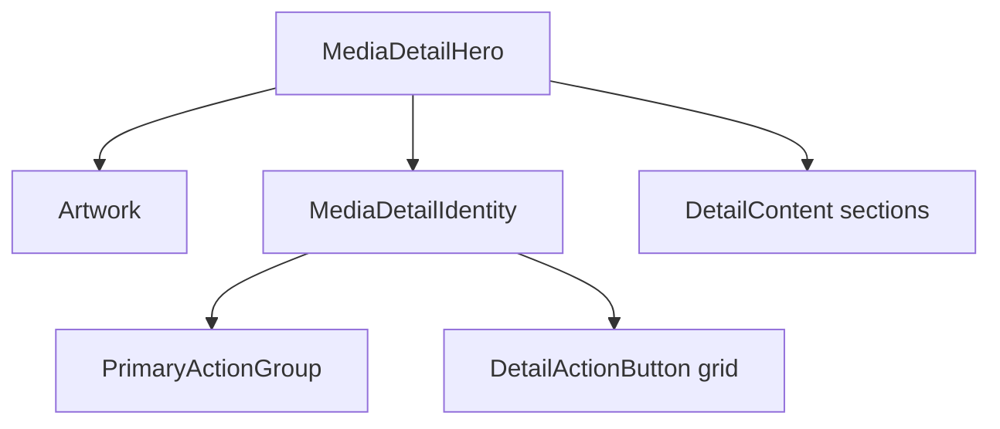

# Renderer Design System

This document is the implementation reference for renderer-wide visual
consistency. The current album detail and filtered library screens are the
canonical visual source. This system preserves that identity; it does not
introduce a separate look.

## Ownership

- `src/renderer/src/app/theme.ts` owns reusable visual values.
- `src/renderer/src/components/view/` owns page composition and state
  primitives.
- `src/renderer/src/components/media/` owns reusable media presentation.
- Feature modules own queries, mutations, routing decisions, playback
  dispatches, menus, dialogs, and resource-to-presentation mapping.
- A local visual value is allowed only when it is genuinely specific to one
  feature. Move a pattern into the theme or a shared component before creating
  its second implementation.

New renderer UI must check theme tokens and existing shared primitives before
adding raw colors, shadows, radii, control heights, page widths, or transition
values. Code review and lint review should treat new literals outside
`theme.ts` and design-system components as a design-system violation unless
the feature-specific reason is documented.

## Responsive Bands

| Band     | Width                   | Contract                                                           |
| -------- | ----------------------- | ------------------------------------------------------------------ |
| Mobile   | below MUI `sm`          | Touch-visible card actions, mobile navigation, compact columns     |
| Compact  | `sm` through below `lg` | Desktop shell with collapsed sidebar and reduced secondary content |
| Expanded | `lg` and above          | Expanded sidebar, full detail and table composition                |

Geometry is verified at 390, 800, 1024, and 1280 px. These are test widths, not
additional breakpoints.

## Theme Tokens

`Theme.design` is typed through MUI module augmentation. It contains:

- `color`: canvas, surfaces, overlays, borders, text roles, accent, and
  now-playing states.
- `layout`: collection/detail widths, responsive gutters, top clearance, and
  player clearance.
- `radius`: cards, artwork, controls, and rows.
- `shadow`: cards, hover elevation, hero artwork, and menus.
- `motion`: fast, standard, and lift transitions.
- `typography`: page title, detail title, media title, metadata, and overline
  roles.

Consume values through an `sx` theme callback:

```tsx
<Box sx={(theme) => ({ color: theme.design.color.textMuted })} />
```

## MediaCard

`MediaCard` is the single structural card for albums and videos.

| Variant     | Artwork geometry | Consumers |
| ----------- | ---------------- | --------- |
| `square`    | 1:1              | Album     |
| `landscape` | 16:9             | Video     |

The component owns the artwork frame, radius, shadow, hover/focus motion,
overlay, touch visibility, play action placement, title typography, and
secondary slot. Resource wrappers own navigation, queue context, favorite
state, menus, fallback artwork content, and metadata formatting.

`PlaylistCard` uses the same card tokens and typography while retaining its
playlist-specific artwork and metadata.

## Media Detail Page

Album, Playlist, Video, and every future page described as "album-style" use
the **Media Detail Page** family.



The shared composition owns hero geometry, artwork sizing, identity placement,
metadata rhythm, primary and secondary action zones, content width, and
responsive spacing. Feature pages supply meaningful actions and domain
content. Empty action placeholders are not rendered.

## Filtered Collection Page

Albums, Songs, Videos, Playlists, and future searchable library collections
use the **Filtered Collection Page** family.

The contract is:

1. `PageScaffold` supplies route clearance and canvas.
2. `CollectionHeader` supplies the title, overflow action, and filter.
3. `CollectionContent` aligns the grid or table exactly with the header.
4. `PageState` presents loading, empty, filtered-empty, and error states.

The content may be a grid or table. It must not introduce independent page
widths or gutters.

## Actions And Tables

- `PrimaryActionGroup` owns the shared Play/Shuffle geometry and labels.
- `DetailActionButton` owns vertical icon-action presentation.
- `DetailActions` owns primary/secondary action-zone alignment.
- Media tables use shared theme text, border, row, active-state, and
  responsive-column values.
- Accessible names are behavior contracts. A visual refactor must preserve
  role/name selectors and keyboard operation.

## Canonical Components

| Component             | Purpose                                        |
| --------------------- | ---------------------------------------------- |
| `PageScaffold`        | Page canvas and shell/player clearance         |
| `CollectionHeader`    | Filtered collection title/filter/action header |
| `CollectionContent`   | Aligned collection grid/table container        |
| `PageState`           | Loading, empty, and error presentation         |
| `MediaCard`           | Album/video card structure                     |
| `MediaDetailHero`     | Album-style responsive hero                    |
| `MediaDetailIdentity` | Detail title, metadata, and action placement   |
| `DetailContent`       | Detail-page section width and gutters          |
| `PrimaryActionGroup`  | Play and optional Shuffle actions              |
| `DetailActionButton`  | Vertical secondary action                      |
| `DetailActions`       | Detail action-zone layout                      |

## Adding A Pattern

1. Confirm an existing token or primitive cannot express the requirement.
2. Keep domain behavior in the feature wrapper.
3. Add the reusable visual contract to the theme or shared component.
4. Document variants and responsive behavior here before a second consumer is
   introduced.
5. Add unit coverage for the contract and geometry E2E coverage when layout
   changes.
